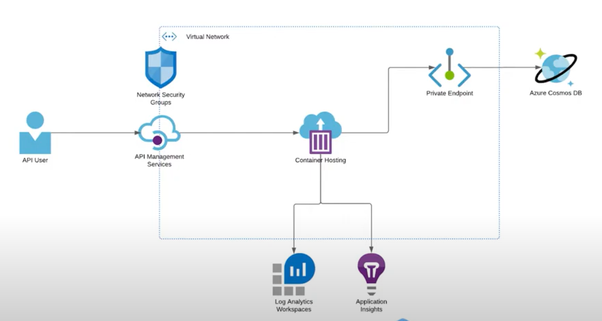

## Getting started

### Requirements

* Azure Only
* Run a multi-container based application
* Using DAPR
* NoSQL DB
* Access to data stores to be locked down
* API Security is critical
* Three Environments: Dev, Test & Prod
* Highly available within a region in production
* Active/Active across two regions in production
* Logging and Monitoring
* CI/CD for infrastructure deployment
* Cost should be kept to a minimum

### Possible Solutions
* Container solution + DAPR
* Cosmos DB
* Private endpoints for DB access
* APIM (API Management)
* Cosmos is Highly available, should look for container solution closer
* Load balancing is required like Traffic Manager or smth else for Active/Active
* Log Analytics and App Insights(for App metrics)
* CI/CD: Github/Azure Devops
* DB, Container, APIM can be quite costly, so have to investigate

For private endopoints we need a virtual network 

### Initial design

### Tools

* Azure CLI
* Bicep CLI
* Git Repo
* VSCode
* Bicep Plugin